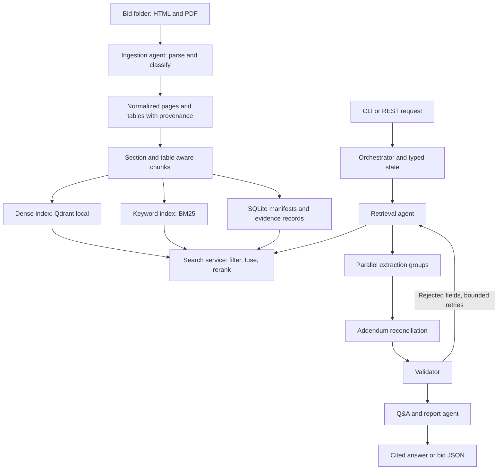

# RFP Intelligence Platform: implementation plan and decision record

Status: initial planning record. Implementation and retrieval evaluation now exist; see README.md for verified status and remaining live-generation deliverables, and docs/DECISIONS.md for changes to these initial choices.
Date: 3 October 2026.
Source: `Assignment-AI Engineer.pdf`, all seven pages. Requirement references below use its section numbers.

## 1. Goal and scope

Build a Python application that processes each bid folder as one unit, exposes an independently usable hybrid search engine, and coordinates specialized agents to produce grounded extraction JSON and cited answers. Support a new bid folder without code changes.

Include all mandatory requirements from sections 5-11. Defer the section 12 bonuses: web UI, OCR, dedicated comparison/report agent, go/no-go recommendations, semantic caching, Docker deployment and CI. Basic cross-bid questions remain required even though the dedicated comparison agent is deferred. Token and latency logging remain required observability even though advanced per-run cost tracking is deferred.

Reason: retrieval and multi-agent orchestration each carry 25% of the score; extraction carries 20%. A polished UI would not compensate for weak evidence retrieval or incorrect addendum handling.

## 2. What was inspected

- Bid1 contains one HTML page, a 62-page RFP, a five-page Addendum 1 and a one-page Addendum 2.
- Bid2 contains one HTML page, a four-page PORFP, three-page specifications, a three-page contract affidavit and a one-page mercury affidavit.
- All seven bid PDFs produced text during a preliminary extraction check. This does not establish complete parsing quality or rule out individual scanned pages.
- Bid1 Addendum 2 explicitly sets the deadline to July 9, 2024, 2:00 PM CST and says other provisions remain unchanged.
- Bid2 specification text separates SKU values from descriptions in simple extraction. Table geometry must preserve their relationship.
- These observations come from inventory and PDF text sampling, not a complete review of every bid requirement. HTML parsing quality still needs inspection in phase 1.

Reason: these inputs suggest that evidence provenance, long-document retrieval, table parsing and field-specific overrides are the main early risks. The observed deadline is a test fixture, never a hard-coded production answer.

## 3. Architecture



Search is a service with a stable typed contract; agents call it and receive selected evidence, never entire documents. Ingestion is a deterministic agent role that reads files by necessity; the whole-document prompt restriction applies to reasoning agents.

Reason: search can be tested independently, and agent complexity cannot conceal retrieval failures. Deterministic parsing does not benefit from an LLM making tool-routing decisions.

## 4. Technology decisions and tradeoffs

These are initial engineering choices, subject to the specified experiments. Pin compatible package versions after a clean setup test; do not invent version numbers now.

| Decision | Selection | Reason and tradeoff |
|---|---|---|
| Language | Python 3.11 | Meets Python 3.10+ requirement and keeps parsing, retrieval and agent code in one ecosystem. |
| PDF parsing | pdfplumber for text, coordinates and tables; pypdf for basic metadata/readability checks | Tables and page provenance are critical. Start with one primary parser rather than several heavyweight pipelines; escalate only if inspected output demonstrates a failure. |
| HTML parsing | BeautifulSoup with an explicit content-cleaning stage | Local saved HTML needs headings, lists and tables preserved. DOM structure is more useful here than flattening everything into prose. |
| Contracts | Pydantic models | Validate every agent message and public request; prevent malformed JSON and inconsistent field shapes. |
| Dense embeddings | `BAAI/bge-small-en-v1.5` through Sentence Transformers | Initial small English model suitable for local CPU work. Benchmark before committing; smaller size trades semantic capacity for lower setup and inference cost. Model/tokenizer limits must govern chunking. |
| Vector storage | Persistent Qdrant local mode | Payload filtering and point upserts support bid-scoped search and incremental indexing without requiring a server. Intended for a single application process; hide it behind an interface if concurrency later requires server mode. |
| Keyword search | `rank-bm25`, rebuilt for affected bid partitions from stored chunks | Adequate for this small corpus and transparent to test. New files need not be reparsed or re-embedded; rebuilding a small keyword partition is acceptable. Large-corpus scaling would require a different backend. |
| Canonical storage | SQLite plus retained original files | Stores manifests, normalized evidence and index generations; provides durable provenance without another service. It duplicates vector payload metadata deliberately so evidence verification does not depend on ranking infrastructure. |
| Fusion | Reciprocal Rank Fusion, initial constant 60 | Dense and BM25 scores have incompatible scales; rank fusion avoids arbitrary score normalization. Tune only on a development subset. |
| Reranking | `cross-encoder/ms-marco-MiniLM-L6-v2` | A separate relevance pass meets the mandatory reranking requirement; local inference avoids extra LLM calls. Measure latency and retrieval gain because generic web relevance may not fit procurement documents perfectly. |
| Query understanding | Conservative field synonym expansion plus structured LLM rewrite for free-form questions | Handles deadline/due-date language while preserving identifiers, quantities, negations and user filters. Search both original and rewritten queries so a bad rewrite cannot erase the original intent. |
| Generation | One hosted LLM through a narrow configurable provider adapter | Structured extraction and contradiction reasoning warrant a capable model, but provider choice must match available credentials. Require `LLM_PROVIDER`, `LLM_MODEL`, and its API key; do not assume an account or choose an unverified model name. Run a small schema/evidence smoke test before fixing the model. |
| Orchestration | Explicit asynchronous state machine using asyncio and typed role interfaces | Assignment permits custom orchestration. The graph is small and bounded; explicit transitions make retry behavior easy to explain and test without adding an agent framework. Cost: we own scheduling and state transitions. |
| Interfaces | CLI first; thin FastAPI REST layer over the same services | CLI is the quickest reproducible submission path; REST demonstrates search as an independent tool. Both avoid duplicating business logic. |
| Tests and logs | pytest and structured JSONL events | Meets parsing/search testing and trace requirements with few services. No external observability account needed. |

Technical references checked for the proposed approach:
- [pdfplumber official repository and table API](https://github.com/jsvine/pdfplumber)
- [Qdrant payload filtering documentation](https://qdrant.tech/documentation/search/filtering/)
- [Qdrant Python client and local mode](https://github.com/qdrant/qdrant-client)
- [Sentence Transformers retrieve-and-rerank documentation](https://www.sbert.net/examples/sentence_transformer/applications/retrieve_rerank/README.html)
- [BGE small English model card](https://huggingface.co/BAAI/bge-small-en-v1.5)

## 5. Evidence and indexing design

### Parsing and provenance

Assign a bid ID from the folder, namespace file IDs within the bid, and compute SHA-256 fingerprints. Record file name, relative path, document type, addendum number, source-stated date, PDF page number, parser warnings and original text spans. Use configurable filename/content rules for classification; classify ambiguous files as unknown with a warning rather than guessing.

Retain raw text and cleaned text. Remove headers/footers only when their position and repetition support doing so; avoid deleting legitimate repeated requirements. Fix line wraps and prose hyphenation conservatively; preserve SKUs, model names and original date strings.

For HTML, use section/DOM locators and `page: null` with `source_type: html`; HTML has no physical PDF page number. For PDFs use one-based physical page numbers. Keep table headers, cell coordinates, row relationships and page provenance. Split large tables by rows with repeated headers; attach text around the table for context. Join table continuations only with matching headers and supporting page context.

Reason: exact values need exact evidence, and cleaning must not alter the very identifiers keyword search should find.

### Chunking

Start with approximately 350 model tokens per prose chunk and 50 tokens of overlap within the same section. Keep page boundaries where practical; represent multi-page evidence with explicit spans rather than one misleading page number. Prefix embedding/search text with the section heading and document type, while keeping source quotations distinct from added context. Keep question-and-answer pairs in addendums together where they fit.

Do not split a table row across chunks. Count heading prefixes and query overhead against the actual tokenizer limit; oversized rows need controlled splitting with retained identifiers and headers. Evaluate 250 versus 350 tokens on development questions before freezing the configuration.

Reason: smaller coherent passages improve retrieval precision, while headings and overlap reduce loss of context. These sizes are hypotheses, not demonstrated optimal settings.

### Incremental indexing

Fingerprint each file and record parser, chunker and embedding configuration versions. Skip unchanged files. On changed/deleted files, replace/remove their chunks from both search branches. Changing the embedding model requires a compatible collection rebuild; a new bid does not.

Use generation IDs and an active-generation manifest: populate new records, verify both search branches, then activate them. Search only active generations. Retain the previous generation if indexing fails, and clean stale records after activation. Protect writes with a single-process indexing lock.

Reason: SQLite and Qdrant do not share a transaction; versioned activation avoids partially updated search results.

### Search contract and pipeline

`search(query, bid_ids, doc_types, addendum_numbers, top_k)` returns ranked evidence with chunk ID, file, page/locator, exact text, metadata and diagnostic scores.

1. Validate filters and preserve exact bid/SKU/model tokens in keyword tokenization.
2. Expand conservatively; retain the original query.
3. Retrieve initially 30 candidates from each branch with identical metadata filters applied before ranking.
4. Fuse and deduplicate candidates by stable ID.
5. Rerank up to 30 fused candidates and return initially five results.
6. Fetch adjacent section/table evidence through the same evidence tool when necessary, under a token budget.

Reason: filters prevent evidence leaking between bids; candidate retrieval supplies breadth, and reranking supplies precision. Candidate counts are configurable and require evaluation.

## 6. Agents, contracts and control flow

Shared state includes run ID, task mode, bid IDs, plan, evidence references, draft fields, reconciliation history, validation results, per-field retry counts, errors and final output. Parallel workers return immutable typed patches; the orchestrator merges them to avoid concurrent state mutation.

| Role | Responsibility | Reason |
|---|---|---|
| Orchestrator | Plan field/query tasks, route roles, merge results, enforce limits and completion | Centralizes control flow and prevents unbounded agent conversations. |
| Ingestion | Classify, parse, normalize, chunk and trigger indexing | One accountable role owns evidence provenance and failures. |
| Retrieval | Rewrite questions, call search with filters, return cited evidence | Keeps ranking behavior consistent across extraction and Q&A. |
| Dates and logistics extraction | Deadlines, term, meetings, submission, installation, delivery | These fields share temporal and operational context. |
| Commercial and legal extraction | Bonds, payment, documentation, manufacturer authorization, contract vehicle | Separates mandatory obligations from boilerplate and blank forms. |
| Product and identity extraction | Bid number/title, products, models, SKUs, specifications, contact and issuer | Keeps related products and their specifications aligned. |
| Reconciliation | Retrieve base and addendum evidence per affected field; decide supported changes | Latest addendum does not automatically replace every original field. |
| Validator | Schema, citation, support, consistency and missing-field checks; return reasons | Makes unsupported answers explicit and drives focused repair. |
| Q&A/report | Generate cited answer or final JSON and 3-6 sentence summary | Synthesizes only validated evidence; final prose cannot introduce new facts. |

Extraction flow: ingest/index -> retrieve per field group -> extract groups concurrently -> reconcile -> validate -> retry rejected fields -> validate summary -> finalize. Start with concurrency three and at most two field-repair attempts after the initial attempt. Failed infrastructure calls have a separately bounded timeout/backoff policy; log both limits.

Q&A flow: determine bid/filter scope -> retrieve evidence -> reconcile affected facts -> draft answer -> validate claims/citations -> bounded repair -> final answer. Cross-bid questions retrieve separately for each bid before combining evidence. A comparison question does not require a separate bonus agent.

All role inputs and outputs use typed schemas: `SearchRequest`, `Evidence`, `FieldCandidate`, `ChangeRecord`, `ValidationIssue`, `AgentResult` and `RunState`. Tool access is allowlisted, and document text is treated as evidence rather than executable instructions.

Reason: prompts alone do not guarantee trustworthy control flow, citation validity or resistance to instructions embedded in documents.

## 7. Extraction semantics and addendums

Preserve all 20 external field names exactly:

1. Bid Number
2. Title
3. Due Date
4. Bid Submission Type
5. Term of Bid
6. Pre Bid Meeting
7. Installation
8. Bid Bond Requirement
9. Delivery Date
10. Payment Terms
11. Any Additional Documentation Required
12. MFG for Registration
13. Contract or Cooperative to use
14. Model_no
15. Part_no
16. Product
17. contact_info
18. company_name
19. Bid Summary
20. Product Specification

Each field contains `value`, `sources`, `confidence` and `notes`. Use typed internal values and a documented stable JSON representation. Lists must preserve product-to-model-to-SKU-to-specification associations and claim-level citations, rather than combine unrelated rows.

- Supported values require at least one verifiable source. Citations include file/page and internal chunk/span identifiers; validate that cited evidence belongs to the selected bid.
- Unknown values use `null`, an empty source list and a reason such as `Not found in documents`. Retain attempted-search evidence in the trace.
- Explicit source statements such as “not required” or “no meeting” are supported values with citations; silence is not equivalent.
- Preserve source-stated time zones. Bid1's July deadline says CST: do not silently reinterpret it as daylight time. If the zone is ambiguous, record the raw statement and flag it. Never invent missing time or zone information.
- A blank affidavit is evidence that a form exists, not proof it is mandatory; retrieve the RFP instructions to establish that obligation.
- Compare addendum numbers, source dates and explicit supersession language. Change only affected fields; leave unrelated terms intact. If precedence remains unresolved, mark the affected field unresolved rather than arbitrarily select a value.
- Record old value, new value, affected field, authority evidence and rationale in `addendum_changes`. Summaries must reflect reconciled values.
- Confidence is an explainable evidence-quality score based on directness, completeness, consistency and validation; it is not a calibrated probability. Missing fields remain low-confidence for the absent value, even if the search was thorough.
- `validation.passed`, `failed` and `not_found` must sum to 20. A failed unsupported candidate becomes null with a validation reason and remains counted as failed, distinct from ordinary not-found fields. Partial results remain clearly marked.

Reason: honest uncertainty and precise precedence handling matter more than filling every field with a plausible answer.

## 8. Implementation phases and completion gates

Indicative effort: 8-12 focused engineering days for one engineer, subject to parser quality and model access. These are work estimates, not a submission deadline.

| Phase | Work | Completion gate | Why this order |
|---|---|---|---|
| 1: Contracts and corpus audit, 1 day | Inspect HTML, representative tables and addendums; define schemas, configuration and manual truth fixtures | Inventory every file; document parsing risks; all 20 fields represented | Prevents later rework from losing provenance or misreading tables. |
| 2: Ingestion, 1-2 days | PDF/HTML parsing, cleanup, metadata, table normalization, failure report | Tests cover text, tables, blank/scanned/unreadable pages; manually verify critical table relationships | Agents cannot recover information corrupted during parsing. |
| 3: Search, 2 days | Chunking, dense/BM25 indices, fusion, reranking, filters, standalone CLI/API | Search returns traceable evidence; adding/changing/deleting a file updates results correctly | Search is independently graded and grounds every reasoning step. |
| 4: Retrieval evaluation, 1 day | Label passages, compare configurations, inspect misses | Actual Recall@k and MRR results saved with configuration and corpus fingerprint | Fix retrieval before trying to improve extraction prompts. |
| 5: Agent workflow, 2-3 days | Roles, parallel groups, reconciliation, validator, retries, Q&A, JSONL traces | Both modes run; rejected fields trigger targeted repair; timeout/bad JSON/empty retrieval do not crash the whole run | Adds reasoning only after evidence tools are reliable. |
| 6: Accuracy and robustness, 1-2 days | Review both 20-field outputs; test unfamiliar folder structure; fix observed failures | Supported fields have valid citations; known overrides correct; no bid-specific code branches | Demonstrates generalization and honest missing-data handling. |
| 7: Submission, 1 day | README, architecture, results, outputs, 10 Q&A examples, full trace, demo | Clean setup and one-command run reproduced; deliverable checklist complete | Reproducibility and explainability are graded requirements. |

## 9. Evaluation and testing

Create at least 20 manually labeled retrieval questions across both bids, exceeding the minimum 15. Cover exact identifiers/SKUs, deadlines, addendum changes, technical tables, warranties, affidavits and commercial terms. Label source file, page/HTML locator and expected supporting spans; permit multiple relevant passages. Do not let an LLM grade its own retrieval ground truth.

Split development and held-out questions before tuning. Compare dense-only, hybrid and hybrid-plus-reranker with identical chunk corpus, query set and filter conditions. Report Recall@1/3/5 and MRR@5, question counts and per-bid results. For multi-passage questions measure supporting-passage coverage as well, so one correct passage cannot conceal incomplete evidence. Keep no-answer cases in a separate abstention evaluation because Recall/MRR require positive relevance labels.

Reason: this isolates what keyword retrieval and reranking add, and avoids tuning and reporting on the same small set without disclosure. No numerical results should be written until the evaluation actually runs.

Tests include:
- Parsing: table SKU-description alignment; HTML navigation cleanup without losing dates; page numbering; repeated-header cleanup; broken-file isolation; scanned-page warning without OCR.
- Search: exact identifier tokens, filter behavior on both branches, known relevant passages, citations, stable IDs and incremental create/change/delete behavior.
- Agents: invalid JSON recovery, unsupported citation rejection, feedback loop limits, non-overriding addendum, conflicting dates and cross-bid evidence isolation.
- End-to-end: both folders yield schema-valid 20-field records; Bid1 Addendum 2 deadline is reflected with evidence; missing facts are null; Q&A supports at least ten demonstrated questions.
- Generalization: hold out an additional bid folder if available. Otherwise rename/rearrange a fixture and vary headings/file names to test assumptions, explicitly documenting that this is weaker than evaluation on a genuinely unseen bid.

Use deterministic fake model/tool responses for failure-path tests and a small live-model smoke test for integration. Manually review field correctness and claim-level citation support; automated schema validation alone cannot establish extraction accuracy.

## 10. Planned repository and interfaces

```text
rfp_intelligence/
  config.py
  schemas.py
  ingestion/       # parsers, cleanup, classification, provenance
  search/          # chunks, embeddings, BM25, fusion, reranking
  storage/         # manifests, evidence, active generations
  agents/          # roles, prompts, state, orchestration
  providers/       # configurable LLM adapter
  api/             # FastAPI routes
  cli.py
eval/              # labels, retrieval runner, reports
tests/             # parsing, search, orchestration fixtures
outputs/           # bid JSON, sample Q&A and example trace
docs/              # architecture and implementation decisions
README.md
.env.example
pyproject.toml
```

Proposed commands after setup:

```text
python -m rfp_intelligence.cli extract --bid ./Bid1
python -m rfp_intelligence.cli index --bid ./Bid2
python -m rfp_intelligence.cli search --query "required affidavits" --bid-id Bid2
python -m rfp_intelligence.cli ask --query "What changed in Addendum 2?" --bid-id Bid1
python -m rfp_intelligence.cli serve
```

REST: `POST /index`, `GET /search`, `POST /extract`, `POST /ask`. Requests take validated local bid-folder references within a configured data root. Indexing and extraction return explicit completion/partial-failure status. These are planned contracts, not currently runnable commands.

Reason: an extraction command includes indexing when needed, satisfying one-command operation after setup; search remains independently available.

## 11. Error handling and observability

Log run/agent IDs, bounded input/evidence references, tool requests, structured outputs, validation reasons, model/config versions, tokens when provided, latency and retry counts. Redact credentials and avoid unnecessarily duplicating entire documents in traces. Export one complete extraction trace with the submission.

Isolate failures per file and field. Mark an incompletely parsed corpus in output so null values are not mistaken for proven absence. Apply request timeouts and bounded backoff; repair malformed structured responses once within configured limits; finalize partial results when limits are exhausted. Missing credentials fail generation with a useful setup error while indexed search remains usable.

Reason: the reviewer should be able to explain how each value was reached and identify whether failure came from parsing, retrieval or reasoning.

## 12. Decision discipline and final deliverables

During implementation, record material choices in `docs/DECISIONS.md` using: decision ID, requirement/problem, options considered, chosen action, reason, expected tradeoff, evidence/test, outcome and revisit trigger. Use small entries for changes to dependencies, models, prompts, chunking, ranking, precedence rules and scope. Record phase actions and their purpose in `docs/WORK_LOG.md`. Do not claim successful tests or measured gains without saved evidence.

Reason: this plan captures initial reasoning; a living decision record captures why implementation changes were made and prepares the engineer to explain the system during review.

Required submission checklist:
- Source repository and reproducible dependency setup; environment/config-driven secrets and model names.
- README covering installation, both task modes, standalone search, all design choices, assumptions and limitations.
- Architecture diagram and documented typed agent communication.
- One reviewed JSON output per supplied bid with all 20 fields, citations, confidence, changes and validation.
- Retrieval question set and measured comparison table for at least two configurations (plan uses three).
- At least ten sample cited Q&A answers, including cross-bid and addendum questions.
- One complete extraction trace demonstrating agent steps and feedback behavior.
- Five-to-ten-minute recorded demo or live demonstration.
- Parsing and search unit tests, plus targeted orchestration/integration checks.

No bonus work should begin until these gates pass. Immediate next implementation step: establish schemas and inspect HTML/table parsing with representative source fixtures.
